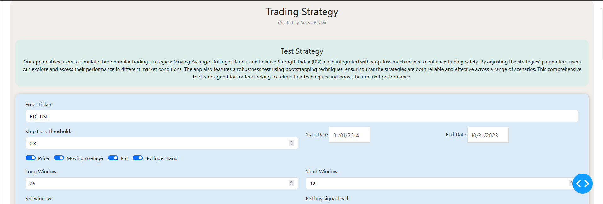
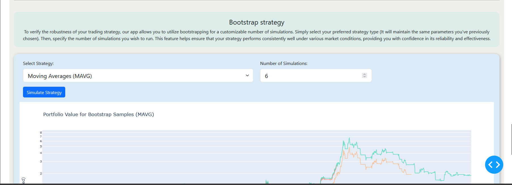

# Technical Strategy Analyzer

## Overview

Technical Strategy Analyzer is a sophisticated tool designed using Python and the Dash framework. It allows users to analyze and backtest technical trading strategies on various assets. The tool also verifies the robustness of these strategies through bootstrapping techniques, ensuring reliable performance metrics.

  

## Colab Notebook

You can also run the code using the provided Colab notebook for easy setup and execution:

[Run in Colab](https://colab.research.google.com/drive/15DW26LF3RR_pZwhrIh6Lmap6Ub_92_LO?usp=sharing)

## Features

- **Backtesting:** Analyze historical data to evaluate the performance of technical strategies with customizable parameters.
- **Bootstrapping:** Employ resampling methods to validate strategy reliability and performance consistency.
- **Interactive Interface:** Built with Dash for a user-friendly, web-based experience featuring dynamic graphs and controls.

  

## Prerequisites

Before you begin, ensure you have the following installed:

- Python 3.x
- pip (Python package installer)
  (Install the necessary python packages)

## Configuration

### Strategy Parameters

- **Indicators:** Choose from various technical indicators like Moving Averages, RSI, MACD, etc.
- **Timeframes:** Select the desired timeframe for backtesting (e.g., daily, weekly).
- **Asset Selection:** Analyze different assets by specifying their ticker symbols.

### Bootstrapping Options

- **Resampling:** Define the number of resamples for bootstrapping.
- **Confidence Intervals:** Set confidence levels for performance metrics.

## Example

To get started with a simple Moving Average strategy, follow these steps:

1. Open the application.
2. Select "Moving Average" from the strategy dropdown.
3. Configure the short and long period parameters.
4. Click "Run Backtest" to see the results and visualizations.

## Contribution Guidelines

We welcome contributions! Here’s how you can help:

1. Fork the repository.
2. Create a new branch (`git checkout -b feature-branch`).
3. Commit your changes (`git commit -m 'Add some feature'`).
4. Push to the branch (`git push origin feature-branch`).
5. Open a Pull Request.

## Issues and Feedback

For any issues, feature requests, or feedback, please use the GitHub Issues page.

## License

This project is licensed under the MIT License. See the LICENSE file for more details.

## Contact

For any issue or concern you can reach out to me or raise an issue in this repo
